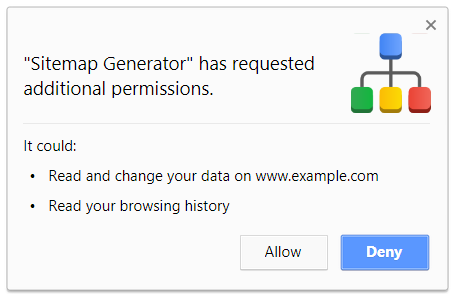

### How to use Sitemap Generator

1. **Click the extension icon** in the top right corner

2. Session configuration window will open. In this window **set your preferences** then click start.

3. The **sitemap generator will launch** in a separate window. You may let this window run in the background. If you wish to terminate the generator for any reason before it completes independently, there is a button to terminate the session.

4. On completion, the **generated sitemap will download** and you can also see it in your downloads folder. This is also the case if you terminate the generator manually, however in that case your sitemap may not include all urls.

#### A few words about permissions

When you use use the extension to crawl some domain for the first time you should see the above prompt. The permissions are required for the sitemap generation to be successful, so make sure you choose 'Allow'.

What the prompt says | Why it is needed
 --- | --- 
**Read and change your data on (some website)** | This permission is needed to be able to make requests in the domain you specified. 
**Read your browsing history** |  This permission actually means extension needs ability to open and close tabs and access their contents. It does not read your browsing history.


